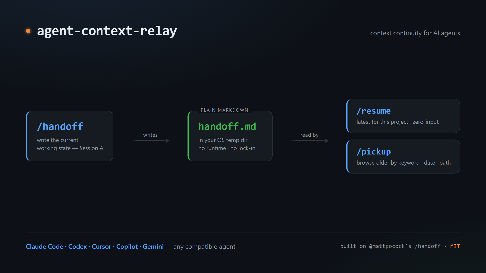

# agent-context-relay — context continuity for AI agents

Keep your working context alive across `/clear` and session boundaries. Pick up exactly where you left off — in the same agent or a different one.

<p align="center">
  
</p>

## Install

I loved Matt Pocock's [`/handoff`](https://github.com/mattpocock/skills) skill but kept wanting more — a zero-input `/resume` that just continues, and a `/pickup` that lets me browse past sessions. So I built on top of it.

```
npx skills add github.com/KehanGong0929/agent-context-relay -y -g
```

`-y` = non-interactive, `-g` = global (available in every project). Drop `-g` to install for the current project only.

The `skills` CLI installs to the compatible agents it detects on your machine — depending on your setup that may include Claude Code, Cursor, Copilot, Codex, Gemini, and others — so one command usually covers everything, with no per-agent setup.

## Commands

| Command | When | What it does |
|---------|------|--------------|
| `/handoff [purpose]` | End of session | Writes a handoff document to your OS temp dir. `purpose` is optional — if omitted, the agent infers it from the conversation. |
| `/resume` | Start of next session | Auto-loads the latest handoff for the current project and continues. No input needed. |
| `/pickup [keyword \| date \| path]` | Start of next session | No argument: shows the 10 most recent handoffs to choose from. With an argument: filters by keyword, date (`2026-06-07`), or file path. |

## The flow

```
# Session A — finish your work, then hand off
/handoff finish the auth middleware

# Manually start a fresh session (your agent's built-in, not part of agent-context-relay)
/clear            # or open a new window in the same folder

# Session B — continue exactly where you left off
/resume
# …or pick a specific one
/pickup 2026-06-07
```

## Works across agents

`agent-context-relay` started life on **Claude Code**, but handoff documents are plain markdown — no dependency on any specific agent's internals.

A handoff written in one agent can be resumed in another — **Codex**, **Copilot**, **Cursor**, **Gemini**, or anything that can read a file. Each skill is a plain-instruction `SKILL.md` that uses the host agent's own file tools — no code, no runtime, nothing to install besides the skills themselves.

```
Claude Code  ──/handoff──▶  handoff.md  ──/resume──▶   Claude Code (new session)
                                         ──/pickup──▶   Codex
                                         ──/resume──▶   Copilot CLI
                                         ──/pickup──▶   any other agent
```

### Triggering the commands in other agents

The `/handoff` style used above is slash-command syntax. agent-context-relay follows the open [Agent Skills](https://agentskills.io) standard, so most compatible agents — Codex, Copilot, Cursor, Gemini — also accept `/handoff`, `/resume`, and `/pickup` directly.

If an agent doesn't support slash commands, just ask in plain language — "hand off this session", "resume the latest handoff", "pick up the handoff from yesterday" — and it will match the skill by its description in the frontmatter.

## What a handoff looks like

See [`examples/handoff-example.md`](examples/handoff-example.md) for a full sample of what `/handoff` actually generates — the structure, the "Next steps", and the "Suggested skills" section that `/resume` and `/pickup` read back.

## How resume and pickup find your project

Both skills glob `handoff*.md` in your OS temp dir and identify the right project by checking whether a document references your **current working directory path** — not by filename. This means:

- Works even if the file was renamed or written by a different agent
- `/resume` picks the newest match for the current project automatically
- `/pickup` lets you browse, filter by keyword, date, or path, and choose

**Limitation:** matching is path-based. If you move or clone the same repo to a different location, `/resume` won't recognise older handoffs written under the old path — use `/pickup` to pick them manually.

## Credits / license

The `/handoff` skill is derived from [mattpocock/skills](https://github.com/mattpocock/skills) (MIT). `/resume` and `/pickup` are original to this pack. See `LICENSE`.
